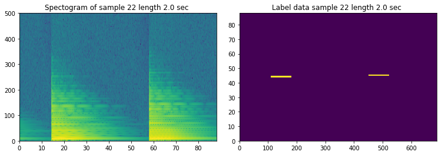

# Piano Music Transcription Project

**Note: this project is a work in progress, still very early stage and not cleaned up for easily understandable presentation.**

This project was inspired by the amazing piano improvisations of jazz pianist Brad Mehldau. If you've never heard him, here's a few samples: 1) [My Favorite Things - Jazz a Vienne](https://www.youtube.com/watch?v=XDDr5TwpJYY), 2) [Blackbird - Live in London](https://www.youtube.com/watch?v=ktZ_gK42rCY), 3) [Paranoid Android - Transcription](https://www.youtube.com/watch?v=dioXSByhtmE), the last of which actually presents a (human) transcription to give you an idea what this project is aiming for.

Like most jazz musicians, most of Mehldau's recordings are live performances, each uniquely improvised on the spot. These rarely get transcribed because of the difficulty of such a task for even a single song performance. Harmony in particular (probably by ear-candy-design, in a manner of speaking) exibits a rich and ever variable mixture of constructive and destructive wave phenomenon and is thus very tricky to reverse engineer into written music.

The goal of this project then is transcription of solo piano recordings, or more precisely to create simplified MIDI files given WAV audio (there are existing tools to translate MIDI into musical notation, which is relatively straightforward by comparison). Though automated musical transcription has received a lot of attention, the programs I could find produced essentially gibberish given a solo Meldau recording. Granted they were free versions, but like most of my projects recently, I'm as focused on curious exploration of ML/Deep Learning/AI as I am on pragmatic end products, plus I know this problem is far from solved in a general.

_____

## Introductory Progress

Thematically my focus thus far has been 1) general MIDI file handling, 2) translation of audio signals into the frequency domain, and 3) processing spectral data with NNs. This strategy (i.e. audio -> spectral -> network -> midi) seemed to be both the most logical approach and a relatively common one, based on my research of other transcription projects.[1](#footnotes) I've employed an open source package: [Mido](https://mido.readthedocs.io/en/latest/) for MIDI file handling, and I'm using SciPy libraries for the spectral translation (Wav file handling and DFTs).

I've experimented with a variety of NN architectures so far, primarily of GRU and CNN-to-Dense varieties. To conduct supervised learning, I've restricted myself to training with audio files that I have corresponding MIDI data for. I also created a very stripped-down MIDI/audio file set of simple ascending and descending chromatic scales. I was surprised to find even this very simple scale test to be non-trivial for a network to predict with perfect accuracy.

I was intrigued to notice that a typical mean-squared-error measurement can be minimized to a high degree of accuracy, but still sound obviously wrong to our ears rhythmically, by which I mean, I believe our minds are judging rhythmic accuracy differently. For example, a drum beat that is consistently late every beat by a half-second sounds more "correct" to us than a drum that is spot on most of the time but erratically drops out without a clear pattern, even though this latter case may be more mathematically accurate according to the MSE measurement).

## Exploring the Repository

Please feel free to run through the notebooks. These should all execute but (my apologies) they are not well commented or organized at this point, many still with draft versions of functions etc. Again, the project is in early stages and has not be manicured for presentation. Generally, you can find .py files in the *mwriter* directory and .ipynb files in the *notebooks* directory. The *sandbox* directory is just very rough, scratch pad stuff at this point.

_____

#### Footnotes:  
>  1 See: [Automatic Music Transcription: An Overview](http://www.eecs.qmul.ac.uk/~ewerts/publications/2019_BenetosDixonDuanEwert_AutomaticMusicTranscription_IEEE-SPM.pdf)